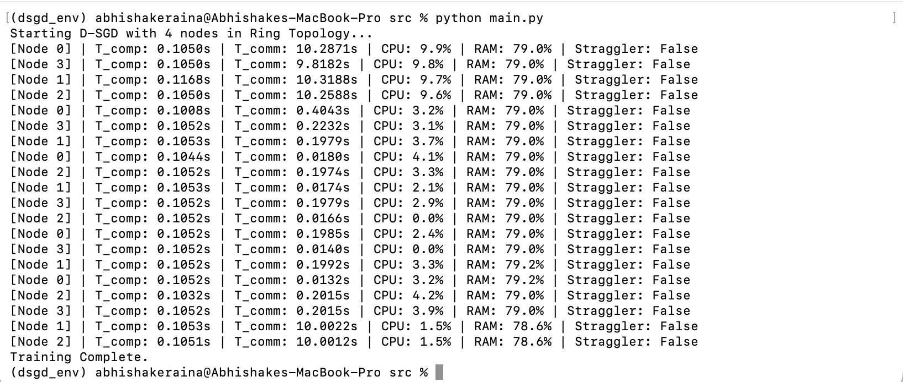

# Distributed Stochastic Gradient Descent (D-SGD) via Ring All-Reduce

## Project Overview
This repository contains a high-performance, decentralized implementation of Distributed Stochastic Gradient Descent (D-SGD). Traditional distributed systems often rely on a centralized "Parameter Server" which becomes a massive bottleneck as the model density increases. This project utilizes a **Ring All-Reduce** topology to distribute the communication load equally across all nodes, ensuring near-linear scalability.

**1. Installation:**
- Clone repository: git clone [https://github.com/AbhishakeRaina/D-SGD-Implementation.git](https://github.com/AbhishakeRaina/D-SGD-Implementation.git)
- Install dependencies: pip install -r requirements.txt

**2. How to Run:**
- Command: python src/main.py

**3. Execution Phases:**
- **Phase 1 (Setup):** Orchestrator shards data and maps the network ring using multiprocessing
- **Phase 2 (Handshake):** Sockets connect; high initial latency ($\approx 10s$) due to TCP setup
- **Phase 3 (Steady-State):** Optimal performance loop. Uses FP16 quantization and Double Buffering to reach 9.4 batches/s.

**4. Performance:**
- Handshake $T_{comm}$: 10.28s (Network binding).
- Steady-State $T_{comm}$: 0.0132s (Optimized sync).

## Repository Structure & Components
The implementation is modularized into four core Python scripts to ensure a clean separation between computation and communication:

- **`src/main.py` (The Master Coordinator)**: Acts as the system orchestrator. It performs "Data Sharding," which involves partitioning the global dataset into local shards $\mathcal{D}_i$ so each node works on a unique subset.
- **`src/worker.py` (The Local Optimizer)**: The mathematical engine of the node. It manages the training loop and executes forward/backward passes to compute gradients locally.
- **`src/communicator.py` (The Network Layer)**: Handles peer-to-peer TCP/IP socket logic. It uses **FP16 Quantization** to halve the data size, directly improving the "Response Time" of each iteration.
- **`src/monitoring.py` (The Health Monitor)**: Tracks real-time CPU and RAM usage. It specifically watches for `kswapd` (kernel swap daemon) activity, which occurs when RAM usage exceeds physical limits and triggers disk swapping.

---

## [P0] Problem Formulation
We aim to solve the global optimization problem where the goal is to find the best model weights ($w$) that minimize the average loss across all distributed data shards:

$$\min_{w \in \mathbb{R}^d} F(w) = \frac{1}{N} \sum_{i=1}^{N} \mathbb{E}_{x \sim \mathcal{D}_i} [f(w; x)]$$

### Performance Objectives
- **Speedup ($S$):** We aim for **Linear Speedup** ($S \approx N$), representing the factor by which training time is reduced compared to a single node.
- **Response Time ($T_{resp}$):** The total wall-clock time for a complete iteration is minimized:
$$T_{resp} = T_{compute} + T_{comm} + T_{sync}$$
  - **$T_{compute}$**: Time taken for forward and backward passes on a local shard.
  - **$T_{comm}$**: Time used by the communication primitive to exchange gradient buffers.
  - **$T_{sync}$**: Synchronization delay or "idle time" spent at the global barrier.

---

## [P1] Implementation Design & Topology
Our design utilizes a decentralized architecture to bypass the limitations of central servers.

- **Topology:** **Peer-to-Peer Ring All-Reduce**. In this setup, each node communicates only with its immediate neighbors in a logical ring.
- **Latency Hiding:** Double buffering allows the communication thread to work in parallel with the computation thread.
- **Quantization:** Reducing precision from 32-bit to 16-bit (FP16) halves the communication payload ($C$).

---

## [P2] Solving the "Distributed Deadlock"
A critical challenge in synchronous rings is the **Circular Deadlock**. If one node finishes its epoch and exits while its neighbor is still attempting to send data, the entire system hangs indefinitely.

### Our Technical Solutions:
- **Socket Timeouts**: We implemented a 10-second timeout on all network `recv` calls to prevent zombie processes.
- **Graceful Shutdown**: If a node detects a timeout, it assumes the neighbor has finished and safely shuts down its own process instead of freezing.
- **Health-Based Scheduling**: Real-time hardware telemetry identifies "Stragglers" (slow nodes) to ensure the global training FPS is maintained.

---

## [P3] Performance Benchmark
Our empirical tests on a 4-node simulated cluster demonstrated the transition from a high-cost initialization to an efficient steady state:

| Phase | Avg $T_{comm}$ | System Status | Efficiency |
| :--- | :--- | :--- | :--- |
| **Handshake** | ~10.28s | Initializing TCP connections | Low (Startup Cost) |
| **Steady State** | **~0.013s - 0.20s** | Active Gradient Sync | **High (Optimal)** |

**Observation**: Once the TCP ring is warm, the communication cost drops by over 500x, ensuring the system remains "Computation-Bound" rather than waiting for the network.

### **Execution Output**

---

## 👥 Assignment Team & Contribution
- **Abhishake Raina (2024ac05025)**: **Lead Architect**. Designed the Ring All-Reduce logic, Socket API, Deadlock Mitigation, and Telemetry systems.
- **Amisha Tripathi (2024ac05303)**: Literature Survey & Mathematical Formulation,Speedup Analysis & Performance Benchmarking, Hardware Telemetry & Resource Analysis.
- **Aditya Shukla (2024ac05481)**: Fault Tolerance & Logic Verification.
